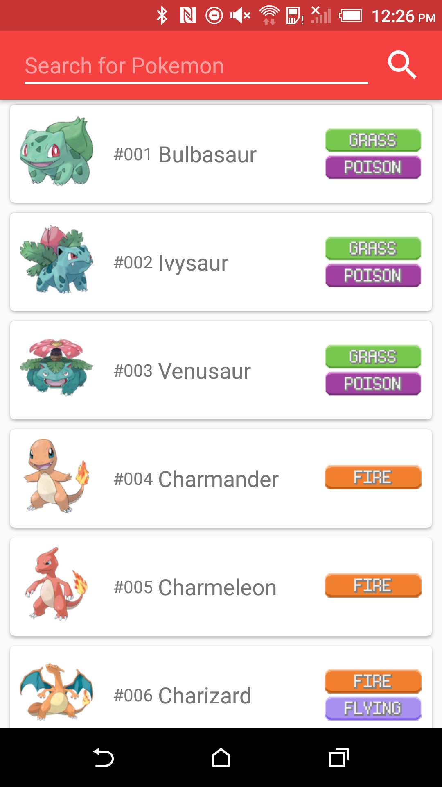

# Misty's Pokedex
A Misty themed pokedex with all current 721 pokemon!

Check out how to use some cool Android transitions, libraries, Material Design and more!

Android technologies used: 
Realm: https://realm.io/news/realm-for-android/  
Gson: https://github.com/google/gson  
EasyPreferences: https://github.com/Pixplicity/EasyPreferences  

Pokemon data taken and altered from this helpful repo: https://github.com/fanzeyi/Pokemon-DB   
Initially tried to use http://pokeapi.co/ API but all those network calls are too slow.   
Pokemon type icons borrowed from: http://aeleks.deviantart.com/art/Bigger-Pokemon-type-icons-and-font-501606704  
Launcher icon adapted from: https://www.iconfinder.com/icons/214848/longico_pikachu_pokeball_pokemon_icon#size=512 (creative commons license)

