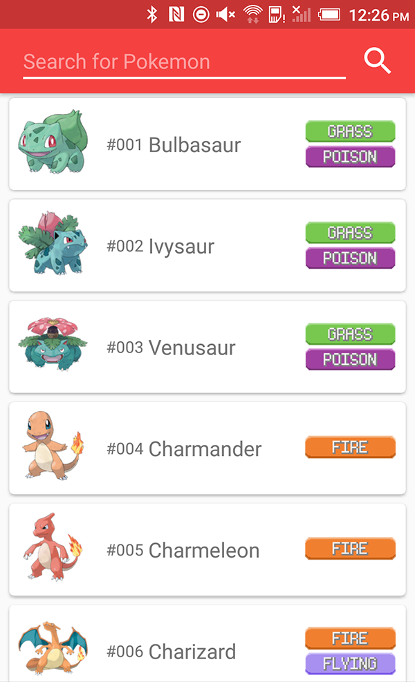
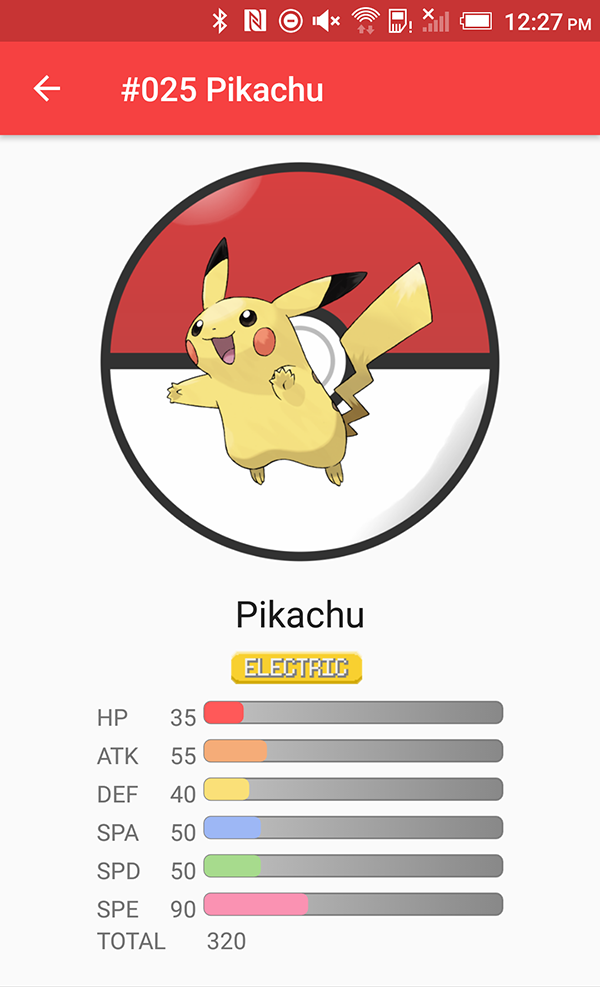
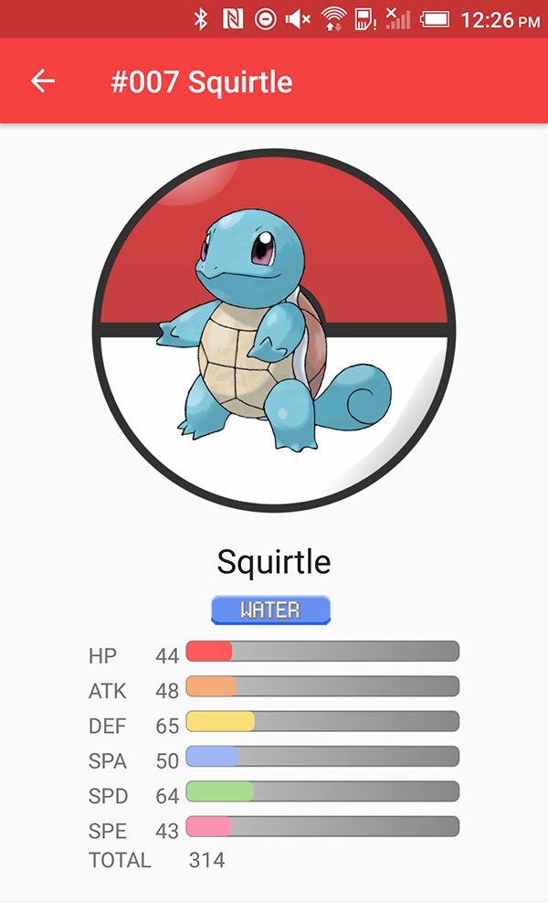

# Misty's Pokedex
**A Misty themed pokedex with all current 721 pokemon!**

Check out how to use some cool Android transitions, libraries, Material Design and more!

  
  
  

##Android technologies used: 
- Realm: https://realm.io/news/realm-for-android  
- Gson: https://github.com/google/gson  
- EasyPreferences: https://github.com/Pixplicity/EasyPreferences  
- Shared Element Transitions: https://developer.android.com/training/material/animations.html  

##More information:
- Free Pokemon API: http://pokeapi.co  
- This app contains all data resources locally because the pokeapi is too slow for an app.

